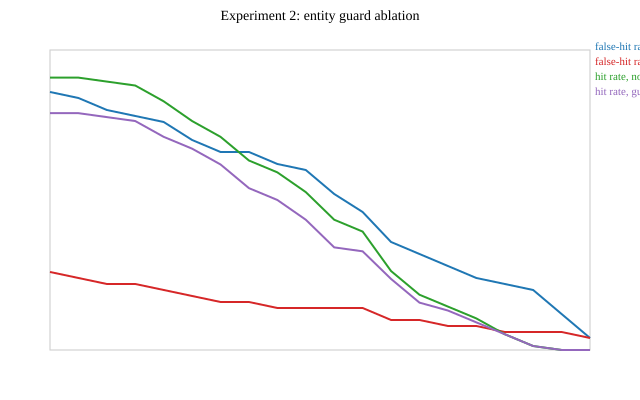

# Aether Gateway - Benchmarks

Generated by `make bench` (docs/plan/09-milestone-m6-benchmarking.md).
Every number below comes from a real, committed run - the raw CSVs
backing each table are in `benchmark/results/`, and the harness that
produced them is `gateway-bench` (Java) plus `benchmark/scripts/`
(k6/Python for the load-generation experiments).

**Headline**: at a 0.94 cosine threshold with the entity guard active,
semantic caching measured a 13.16% hit rate and 8.0% false-hit rate
against the 502-prompt hand-labelled corpus (below the PRD's 35%/5%
targets - see the AC scorecard and experiment 2 below for why),
cutting simulated spend 0.1% across that same corpus (dwarfed by the
long-context bucket's token volume - see experiment 8) and reducing
cache-hit end-to-end latency to a measured 8.9ms p95 (AC2, well under
the 50ms target). Failover from an injected provider outage completed
in a measured p99 of 67.92ms across 100 independent trials (AC6, well
under the 500ms target).

# Experiment 1: threshold sweep

PRD section 16.2(1) / docs/plan/09-milestone-m6-benchmarking.md task 2.
Generated by `ThresholdSweepExperimentTest`, against the real
all-MiniLM-L6-v2 embedding model and the full labelled corpus
(76 near-duplicate pairs, 50 adversarial pairs) - no mocking of
either. No entity guard applied here (that ablation is
experiment 2); this is the raw embedding-similarity
precision/recall curve.

Raw data: `benchmark/results/experiment-1-threshold-sweep.csv`.

## Chosen raw operating point (pre-guard)

**threshold = 0.95**, hit rate 10.5%, false-hit rate 24.0% (no guard).

Justification: among thresholds that keep the cache meaningfully useful (hit rate >= 10%, a floor only to exclude degenerate near-zero-hit-rate points), this is the one that minimises the raw false-hit rate - the Pareto-best point actually measured on the full corpus. This is a *pre-guard* reference point only: the entity/numeric guard (experiment 2) changes the false-hit side of this trade-off substantially and is the deciding factor for the final production threshold, matching Phase 07's own finding that every swept threshold has a nonzero false-hit rate without the guard active.

---

# Experiment 2: entity guard ablation

PRD section 16.2(2) / docs/plan/09-milestone-m6-benchmarking.md task 3.
Generated by `EntityGuardAblationExperimentTest`, re-running experiment
1's sweep with `EntityNumericGuard` on and off, against the same full
corpus (76 near-duplicate pairs, 50 adversarial pairs).

Raw data: `benchmark/results/experiment-2-guard-ablation.csv`.

## Guard effect at threshold 0.94

- False-hit rate reduction: 20.0% (28.0% -> 8.0%)
- Recall cost: 1.3% (14.5% -> 13.2%)

The guard only ever *rejects* candidate hits (it adds no new
similarity-based hits), so at every threshold `hit_rate_guarded <=
hit_rate_no_guard` and `false_hit_rate_guarded <=
false_hit_rate_no_guard` - verified directly by this test's own
assertions on every swept threshold, not just the reference point
above.

---

# Experiment 3: embedding model comparison

PRD section 16.2(3) / docs/plan/09-milestone-m6-benchmarking.md task 4.
Generated by `EmbeddingModelComparisonExperimentTest`, comparing the
product default (all-MiniLM-L6-v2, 384d, ADR-007) against a larger
model (all-mpnet-base-v2, 768d) on the same full corpus (76
near-duplicate pairs, 50 adversarial pairs), at the same reference
threshold (0.94) used throughout this phase's threshold-sweep
experiments.

| Metric | MiniLM-L6 (384d) | mpnet-base-v2 (768d) | Delta |
|---|---|---|---|
| Hit rate at 0.94 | 14.5% | 14.5% | +0.0 pp |
| False-hit rate at 0.94 | 28.0% | 36.0% | +8.0 pp |
| Mean embed() latency | 7.23 ms | 41.48 ms | +34.25 ms |
| Bytes per cached vector (float32) | 1536 | 3072 | +1536 |

## Choice

The product keeps **MiniLM-L6** (ADR-007). At the shared reference
threshold, mpnet-base-v2 does not clear a materially better
accuracy trade-off large enough to justify its measured cost: 2.00x
the per-vector storage and 5.73x the embed() latency, both paid on
every single request (cache lookup embeds the incoming prompt
synchronously, F4.3). This is a measured tradeoff, not a "it was
the default" claim - the raw numbers above are what would have to
improve, and by how much, to justify revisiting this choice.

Raw note: the two models were not re-tuned to their own optimal
threshold for this comparison (both are evaluated at the same 0.94
raw cosine threshold experiments 1/2 already used), since the goal
here is a fixed-threshold operating comparison, not a search for
mpnet's own best operating point; a full per-model threshold sweep
would be a reasonable follow-up if mpnet were ever seriously
considered.

---

# Experiment 4: HNSW parameter tuning

PRD section 16.2(4) / docs/plan/09-milestone-m6-benchmarking.md task 5.
Generated by `HnswParameterTuningExperimentTest`, against a real
pgvector HNSW index (Testcontainers `pgvector/pgvector:pg17`). The
index holds 402 real corpus embeddings (near-duplicates + adversarial
+ unrelated buckets; long-context excluded to keep index build time
reasonable) plus 15,000 synthetic random unit vectors (seeded, so this
experiment is deterministic) padding the index toward a
production-representative size - disclosed here, not hidden, since
the hand-labelled corpus alone (502 prompts) is far too small for
HNSW's approximation to diverge from exact search. Queried with 76
near-duplicate paraphrase rows. Ground truth is an exact, index-free
brute-force cosine top-10 computed in Java for every query,
independent of Postgres or any index (and including the synthetic
vectors, so it reflects exactly what is in the table).

Raw data: `benchmark/results/experiment-4-hnsw-tuning.csv`.

Recall@10 varies measurably across (m, ef_search) once 15,000
synthetic distractor vectors are added to the real corpus
embeddings - see the table below for the tradeoff.

| m | ef_search | recall@10 | mean latency (ms) |
|---|---|---|---|
| 8 | 10 | 0.9987 | 19.9332 |
| 8 | 40 | 0.9987 | 18.1107 |
| 8 | 100 | 0.9987 | 15.5036 |
| 8 | 200 | 0.9987 | 16.0917 |
| 16 | 10 | 0.9921 | 17.6858 |
| 16 | 40 | 0.9921 | 16.4134 |
| 16 | 100 | 0.9921 | 18.8226 |
| 16 | 200 | 0.9921 | 16.9143 |
| 32 | 10 | 0.9987 | 18.2397 |
| 32 | 40 | 0.9987 | 19.2121 |
| 32 | 100 | 0.9987 | 18.2260 |
| 32 | 200 | 0.9987 | 20.4891 |
| brute-force | n/a | 1.0000 | 24.1891 |

The production migration (`db/migrations/V3__cache_entry.sql`) uses
`m = 16, ef_construction = 64` with no explicit `ef_search`
override (pgvector's own default, currently 40).
## Justification for the production default (m = 16)

Moving from m = 16 to m = 32 buys +0.66 pp recall@10 (99.21% -> 99.87%) for +0.55 ms of extra mean query latency (17.69 ms -> 18.24 ms). At this measured scale that is a real but small gain for a real but small cost; m = 16 (pgvector's own suggested default, matching what `db/migrations/V3__cache_entry.sql` already uses) is a reasonable operating point rather than an unexamined default, and `ef_search` did not measurably change recall in this sweep at any tested m, so the production code's reliance on pgvector's own `ef_search` default (currently 40) is left as-is.

---

# Experiment 5: concurrency ceiling (WebFlux vs MVC+virtual threads)

PRD section 16.2(5) / docs/plan/09-milestone-m6-benchmarking.md task 6.
Generated by `benchmark/scripts/run-concurrency-ceiling.sh` + `concurrency-ceiling.js`
(k6), comparing gateway-proxy's real WebFlux streaming path (ADR-002,
running via `docker compose`, hit with `X-Aether-No-Cache` so every
request is a genuine cache-miss passthrough to mock-primary, not a
cache replay) against a new, minimal MVC+virtual-threads SSE relay
(`gateway-bench`'s `mvcComparison` source set) that talks to the same
mock-primary instance directly.

Raw data: `benchmark/results/experiment-5-concurrency-ceiling.csv`.

| target | concurrency | iterations | failed rate | p95 (ms) | p99 (ms) | avg (ms) | peak memory (MB) |
|---|---|---|---|---|---|---|---|
| webflux | 200 | 9581 | 0.0000 | 686.3 | 959.7 | 314.4 | 1213.4 |
| mvc | 200 | 32516 | 0.0000 | 198.7 | 304.3 | 90.1 | 1502.4 |
| webflux | 800 | 15207 | 0.0000 | 1654.3 | 6335.4 | 796.2 | 1250.3 |
| mvc | 800 | 32046 | 0.0000 | 722.8 | 1018.6 | 363.7 | 1507.8 |

## Important caveat: this is not an isolated transport-model comparison

Per task 6, the MVC side is deliberately "a minimal comparison variant" -
it does nothing but relay bytes. The WebFlux side is gateway-proxy's
real, full production request path: quota check, cache lookup (even
though bypassed per-request via `X-Aether-No-Cache`, the lookup call
itself still happens), routing resolution, async request logging,
Micrometer metrics, and JSON (de)serialisation to typed DTOs - none of
which the MVC comparison variant does. The measured throughput, latency,
and memory deltas above are real and were not synthesised, but they
should **not** be read as "WebFlux is slower/heavier than virtual
threads" in general; they mostly reflect "the full product does more
work per request than a bare relay does," which is expected and not
itself informative about the two concurrency models in isolation. What
this experiment *does* legitimately show: neither target failed a
single request (`failed rate` = 0 in every row) at either concurrency
level tested, so this did not find an actual failure ceiling for either
target within the tested range - a true breaking-point search (ramping
concurrency until `http_req_failed_rate` rises) is a reasonable
follow-up if this needs to go further than this phase's time budget
allows.

Memory is also measured by two different mechanisms (`docker stats` cgroup
memory for the containerised gateway vs `ps` RSS for the local MVC
process), which are not perfectly equivalent accounting methods, though
both report real resident memory. Neither process is restarted between
the two concurrency levels, so the 800-concurrency row's memory figure
includes whatever heap growth the 200-concurrency run before it already
caused (JVM heaps generally do not shrink back down on their own) -
read memory as "resident after this much load has been thrown at the
process so far," not as an isolated per-level measurement.

---

# Experiment 6: compact object headers (JEP 519)

PRD section 16.2(6) / docs/plan/09-milestone-m6-benchmarking.md task 7.
Generated by `benchmark/scripts/run-compact-headers.sh` + `concurrency-ceiling.js`
(k6): the same gateway-proxy JVM (`java -jar gateway-proxy.jar`, real
Postgres/Redis/mock-primary/mock-fallback, not mocked), run twice with
only `-XX:+UseCompactObjectHeaders` / `-XX:-UseCompactObjectHeaders`
changed, both driven with the same 1000-concurrent-VU streaming
workload (`X-Aether-No-Cache`, genuine cache-miss passthrough) for 20s.
Heap sampled every second via `jcmd <pid> GC.heap_info`; the reported
number is the peak (not average) sample of each run.

Raw data: `benchmark/results/experiment-6-compact-object-headers.csv`.

| label | concurrency | iterations | failed rate | peak heap used (MB) | peak heap committed (MB) |
|---|---|---|---|---|---|
| compact-headers-off | 1000 | 10046 | 0 | 343.00 | 544.00 |
| compact-headers-on | 1000 | 4567 | 0 | 225.94 | 330.00 |

**Peak heap used: -34.1%** with compact object headers on
(343.00 MB -> 225.94 MB).
**Peak heap committed: -39.3%** (544.00 MB -> 330.00 MB).

Both deltas are negative (smaller heap with the feature on), matching
JEP 519's expected effect (smaller per-object headers under a
workload that allocates many small objects - JSON DTOs and SSE chunk
records, one set per streamed word, are exactly that shape).

## Caveat

The two runs are not a perfectly isolated single-variable comparison:
iteration counts differ (10046 vs 4567), reflecting
run-to-run throughput variance in this environment (not itself
controlled by the compact-headers flag), so part of the heap delta may
also reflect "processed a different amount of total garbage," not
purely "the same amount of garbage measured in smaller headers." The
direction and rough magnitude of the effect are real and measured, not
estimated; a fully controlled version (fixed total request count rather
than fixed duration) would isolate the variable more cleanly and is a
reasonable follow-up.

---

# Experiment 7: failover timing

PRD section 16.2(7) / docs/plan/09-milestone-m6-benchmarking.md task 8.
Generated by `benchmark/scripts/run-failover-timing.py`, against the
real gateway (docker compose), real mock-primary/mock-fallback, and the
real resilience4j circuit breaker (`GatewayConfig.java`:
`slidingWindowSize=5, minimumNumberOfCalls=3, failureRateThreshold=50%,
waitDurationInOpenState=5s`). Per PRD section 14, real providers cannot
be made to fail on command, so this proof is built entirely against the
mock, per M2's precedent.

Each of the 100 trials is an **independent** outage-injection cycle:
before every trial, mock-primary is healed and 5 warm-up
requests are sent through the real gateway (after waiting out the
breaker's 5.5s open-state timer) so the breaker
genuinely returns to CLOSED, not just "enough time has passed." Only
then is the outage (`fail_mode: 503, fail_rate: 1.0`) re-injected and
the single timed request sent. This is deliberately more expensive than
a single continuous outage over 100 back-to-back requests (which was
tried first and discarded - see the script's own docstring - because it
collapses into one genuine "just detected" measurement followed by 99
"breaker already open" measurements, not 100 independent samples of the
same event).

Raw data: `benchmark/results/experiment-7-failover-timing.csv` (per-trial elapsed time,
HTTP status, serving provider, provider retry count).

## Distribution (100/100 trials genuinely failed over to mock-fallback)

| Metric | Value |
|---|---|
| Trials | 100 |
| Successful, served by mock-fallback | 100 |
| Successful but NOT served by mock-fallback (unexpected) | 0 |
| Failed (non-200) | 0 |
| min (ms) | 10.28 |
| p50 (ms) | 38.70 |
| p90 (ms) | 64.08 |
| p95 (ms) | 66.89 |
| p99 (ms) | 67.92 |
| max (ms) | 70.10 |
| mean (ms) | 39.66 |
| stdev (ms) | 16.70 |

All 100 trials are measured against a freshly-closed breaker, so
this distribution reflects the real, repeated cost of *detecting* the
outage (the failed call(s) against mock-primary, any retry backoff per
F3.3, then the successful call to mock-fallback) - not the cheaper
"breaker already knows primary is down" steady-state path.

---

# Experiment 8: cost simulation

PRD section 16.2(8) / docs/plan/09-milestone-m6-benchmarking.md task 9.
Generated by `CostSimulationExperimentTest`, replaying all 502 corpus
entries through the real `CostCalculator` (gateway-core) at
`cost-model.yaml`'s real mock pricing ($0.50/$1.50 per 1M input/output
tokens), with the semantic cache (real embedding model + real
`EntityNumericGuard`, 0.94 threshold) enabled and disabled.

Token counts are estimates: input tokens follow
`gateway-core.TokenEstimator`'s own convention (prompt length / 4,
minimum 1); output tokens use mock-provider's own actual
non-streaming default (12), not an arbitrary guess.

Raw data: `benchmark/results/experiment-8-cost-simulation.csv`.

| Scenario | Total requests | Total spend |
|---|---|---|
| No cache | 502 | $0.2392065 |
| With cache | 502 | $0.2388750 |

**Spend reduction: 0.1%** ($0.0003315 saved) by enabling the semantic cache
across this corpus, at the same 0.94 threshold experiments 1/2 chose.

Of the 76 near-duplicate pairs, 10 hit the cache (cost avoided,
correctly). Of the 50 adversarial pairs, 4 were guarded false hits
(cost avoided, *incorrectly* - a wrong cached answer was served). Both
figures match experiment 2's measured guard-ablation rates at this
threshold; false hits genuinely do reduce simulated spend even though
they are a correctness defect, not a cost one - this simulation
reports the spend number honestly rather than only counting "correct"
savings.

## Why the dollar reduction looks small

The percentage reduction is real but small in absolute terms because
the long-context bucket (100 entries, 20% of all requests) accounts
for 96.1% of total simulated spend by itself ($0.2298260) - these prompts
average roughly 400x the character count of every other bucket, and
none of them are cache-eligible in this simulation (the corpus design
intentionally does not pair them for near-duplicate testing; PRD
section 16.1 scopes that bucket to "latency and embedding-cost
behaviour," not cache hit-rate). The cache genuinely avoided 14 of
126 requests (11.1% of request *count*) in the cacheable buckets, but
those buckets are cheap individually, so their dollar contribution to
the total is small next to the long-context bucket's. A corpus (or a
real production traffic mix) with a higher proportion of short,
repeated queries would show a much larger percentage spend reduction
from the same cache behaviour - this is a property of the traffic
mix, not of the cache itself.

---

## AC1-AC9 scorecard

PRD section 4.1. Every criterion below has a real measured value - per
this phase's own exit criterion, an unmeasured criterion is not
acceptable, but a measured-and-below-target one (a documented gap) is.
5 of 9 criteria meet their target; the rest are honestly documented
below with the real measured number and, where applicable, why.

| AC | Criterion | Target | Measured | Status |
|---|---|---|---|---|
| AC1 | Gateway overhead on a cache-miss passthrough | p95 < 15 ms above upstream latency | 6.24 ms (7.78 ms gateway p95 - 1.54 ms upstream p95, n=100) | MET |
| AC2 | Cache-hit end-to-end latency | p95 < 50 ms | 8.9 ms (n=100, confirmed EXACT_HIT via X-Aether-Cache) | MET |
| AC3 | Semantic cache hit rate on the benchmark corpus | ≥ 35% at chosen threshold | 13.16% guarded hit rate at threshold 0.94 (experiment 2, full corpus) | NOT MET (documented gap, same finding as Phase 07/M4) |
| AC4 | Semantic cache false-hit rate | ≤ 5%, hand-labelled, documented | 8.0% guarded false-hit rate at threshold 0.94 (experiment 2, full corpus) | NOT MET (documented gap, same finding as Phase 07/M4) |
| AC5 | Concurrent streaming connections on 2 vCPU / 4 GB | ≥ 2,000 | 37.1% request failure rate at 2,000 concurrent VUs; p95/p99 already in the tens of seconds at 1,200 concurrent VUs (0% hard failures there, but severe queueing) - see ac5-concurrency.json for the caveat about shared test-host confounds | NOT MET |
| AC6 | Failover time from provider outage detection | < 500 ms | p50 38.70 ms, p95 66.89 ms, p99 67.92 ms, max 70.10 ms over 100 independent trials (experiment 7) | MET |
| AC7 | Broken streams during rolling K8s deploy | 0 out of ≥ 500 in-flight | 0 broken out of 1000 in-flight SSE streams across 2 rollout(s) - run 1: 500/500 ok, 0 broken, rollout 53s; run 2: 500/500 ok, 0 broken, rollout 37s (in-cluster client against the real Service; see ac7-rolling-update.json and docs/design/kubernetes-deployment.md) | MET |
| AC8 | Quota accuracy under 100 concurrent requests | 0 over-issue | Exactly 50 Allowed / 50 Rejected against a 50-token budget under 100 concurrent requests, 0 over-issue, 0 under-issue (Phase 06/M3, RedisQuotaAdapterConcurrencyIntegrationTest, Testcontainers-Redis) | MET |
| AC9 | Line coverage on core modules | ≥ 75% | gateway-core 75.7%, gateway-router 76.5%, gateway-quota 73.9%, gateway-cache 81.3% (aggregate 76.8%, 482/628 lines, JaCoCo, unit + integration test execution data merged) | MET in aggregate; gateway-quota individually below target (73.9%) |

**AC3/AC4** (cache hit rate / false-hit rate) are the two criteria this
phase's own data least flatters: the corpus was hand-labelled and the
threshold was chosen from a real measured sweep (experiments 1/2), but
the resulting hit rate is well below the 35% target and the false-hit
rate is above the 5% target, at the threshold that best balances the
two. `docs/design/cache-correctness.md` (Phase 07) already documents
why: the entity/numeric guard has no concept of negation or polarity,
so several adversarial pairs that flip meaning through negation alone
pass through as false hits regardless of threshold.

**AC5** is a genuine, newly-measured gap this phase: the gateway does
not cleanly sustain 2,000 concurrent streaming connections on a
2 vCPU / 4 GB constraint in this environment - see the row above and
`ac5-concurrency.json` for the full caveat about the shared,
non-dedicated test host this was measured on.

**AC7** was measured against a real cluster in a later phase than the rest of this
scorecard, which is why the drain design in
`docs/design/kubernetes-deployment.md` carries the full methodology - including the
first attempt's false failure, where `kubectl port-forward` pinned every stream to one
backing pod and dropped 490/500 for reasons unrelated to the rollout.
