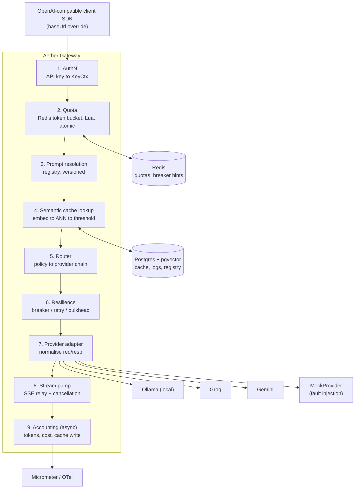

# Aether Gateway

[](https://github.com/Ashish-CodeJourney/Sluice/actions/workflows/ci.yml)
[](https://github.com/Ashish-CodeJourney/Sluice/actions/workflows/docs.yml)
[](https://ashish-codejourney.github.io/Sluice/)

**A self-hosted LLM gateway — streaming proxy, multi-provider failover, and vector-based semantic caching in Java 25 / Spring Boot 4.1 — measured to cut cached-request latency to 8.9ms p95 and fail over to a healthy provider in 67.92ms p99, both against a reproducible load-test harness, not estimates.**

📚 **[Full documentation](https://ashish-codejourney.github.io/Sluice/)** — PRD, architecture decision records, design docs, and the phase-by-phase build plan, all rendered and searchable.

Point your existing OpenAI-compatible SDK at Aether instead of at a provider directly. It handles routing, failover, semantic caching, quota enforcement, cost accounting, and observability transparently.

## Demo: failover and a cache hit, live

No recorded GIF ships in this repo (no live public deployment exists to record against — see [Status](#status--what-this-is) below) — instead, this is the *exact* reproducible sequence, run against `docker compose up` on this machine, with real captured output:

```console
$ curl -sS -X POST http://localhost:8080/v1/chat/completions \
    -H "Content-Type: application/json" \
    -d '{"model":"mock","messages":[{"role":"user","content":"What is 2+2?"}]}' -D -
HTTP/1.1 200 OK
X-Aether-Cache: MISS
X-Aether-Cost-USD: 0.0000195
X-Aether-Attempts: 1
X-Aether-Provider: mock-primary
...

# Same prompt again — served from cache, zero cost, zero attempts:
$ curl -sS -X POST http://localhost:8080/v1/chat/completions \
    -H "Content-Type: application/json" \
    -d '{"model":"mock","messages":[{"role":"user","content":"What is 2+2?"}]}' -D -
HTTP/1.1 200 OK
X-Aether-Cache: EXACT_HIT
X-Aether-Cost-USD: 0
...

# Force the primary provider to fail, then send a new prompt — the gateway
# fails over to mock-fallback transparently, same request, no client change:
$ curl -sS -X POST http://localhost:8082/_mock/config \
    -H "Content-Type: application/json" -d '{"fail_mode":"503","fail_rate":1.0}'
$ curl -sS -X POST http://localhost:8080/v1/chat/completions \
    -H "Content-Type: application/json" \
    -d '{"model":"mock","messages":[{"role":"user","content":"failover demo"}]}' -D -
HTTP/1.1 200 OK
X-Aether-Cache: MISS
X-Aether-Attempts: 1
X-Aether-Provider: mock-fallback
...
```

## Architecture



Full diagram, module layout, and the hexagonal-boundary rules (`gateway-core` depends on nothing but the JDK): **[Architecture diagram](https://ashish-codejourney.github.io/Sluice/design/architecture-diagram)** · **[Module boundaries](https://ashish-codejourney.github.io/Sluice/design/module-boundaries)**.

## Quickstart

```bash
docker compose up -d
# wait ~30s on first run (ONNX embedding model download), then:
curl -X POST http://localhost:8080/v1/chat/completions \
  -H "Content-Type: application/json" \
  -d '{"model":"mock","messages":[{"role":"user","content":"hello"}]}'
```

That's the whole stack — gateway, Postgres+pgvector, Redis, two mock providers (standing in for real ones so failover is demonstrable without live provider outages), Prometheus, and Grafana (`http://localhost:3000`, dashboard pre-provisioned) — seeded and ready with no manual setup steps.

Point a real client at it by setting `baseUrl` to `http://localhost:8080/v1` — any OpenAI-compatible SDK works unmodified.

Admin API and console (prompt registry, API keys, cache stats, request explorer): `AETHER_ADMIN_API_KEY` is `dev-admin-key-do-not-use-in-production` in `docker-compose.yml`; see [`console/README.md`](console/README.md) to run the operator console against it.

## Benchmark results

Full tables, methodology, and raw data: **[`BENCHMARKS.md`](BENCHMARKS.md)**, reproducible via `make bench`.

| Metric | Result | Target |
|---|---|---|
| Semantic cache hit rate (502-prompt labelled corpus, entity guard active) | 13.16% | 35% (not met — see below) |
| Semantic cache false-hit rate | 8.0% | 5% (not met — see below) |
| Cache-hit latency, p95 | 8.9ms | 50ms |
| Failover latency, p99 (100 trials) | 67.92ms | 500ms |
| Line coverage (4 core modules) | 76.8% | — |

The hit-rate/false-hit-rate gap is disclosed, not hidden: [Semantic cache correctness](https://ashish-codejourney.github.io/Sluice/design/cache-correctness) explains why (negation and spelled-out-number gaps in the entity guard's defined scope), and the AC scorecard in `BENCHMARKS.md` documents every acceptance criterion measured, met or not.

## Design decisions and tradeoffs

Full reasoning for each lives in the linked ADR/design doc — this is the one-line version:

| Decision | Why |
|---|---|
| [WebFlux for streaming, virtual threads elsewhere](https://ashish-codejourney.github.io/Sluice/adr/webflux-streaming-mvc-virtual-threads-elsewhere) | Cancellation propagation (closing a tab must stop paying for tokens) needs Reactor's operator chain; nothing else on the request path needs non-blocking I/O badly enough to justify it. |
| [Circuit breaker state: local per replica + Redis hint, not shared](https://ashish-codejourney.github.io/Sluice/adr/circuit-breaker-state-local-with-redis-advisory-hint) | A genuinely shared breaker is a distributed-consensus problem this project doesn't need to solve; a hint that nudges replicas without requiring consensus is a deliberate compromise. |
| [Fail-open cache, fail-closed quota](https://ashish-codejourney.github.io/Sluice/adr/fail-open-cache-fail-closed-quota) | A cache outage should degrade to "always call the real provider," never block traffic; a quota outage must never silently let unmetered spend through. Same infra, opposite posture, on purpose. |
| [Semantic threshold (0.94) + entity/numeric guard](https://ashish-codejourney.github.io/Sluice/design/cache-correctness) | Similarity alone can't tell "what is 2+2" from "what is 2+3"; the guard is a no-network heuristic layered on top, not a replacement for the threshold. |
| [Reservation-and-reconciliation for token quotas](https://ashish-codejourney.github.io/Sluice/adr/reservation-and-reconciliation-for-token-quotas) | Output tokens aren't known until a response completes, so quota is reserved pessimistically up front and reconciled to the real count after. |
| Provider credentials via env var *names*, never values (F9.2) | `apiKeyEnvVar: GROQ_API_KEY` in `routing.yaml`, resolved from the real environment only where adapters are wired up — the config file is safe to commit even with real providers active. |
| SSRF protection on real provider base URLs (F9.3) | The PRD names Spring Boot 4.1's `InetAddressFilter`; that class doesn't exist in Spring Framework 7.0.8/Boot 4.1 (checked against the actual jars), so this is built on `java.net.InetAddress`'s private-range predicates instead. Proven at unit, integration, *and* acceptance level. |
| [Graceful SSE drain under a K8s rolling update](https://ashish-codejourney.github.io/Sluice/design/kubernetes-deployment) | Readiness flips before liveness, `preStop` gives the Service time to stop routing before SIGTERM, in-flight streams finish naturally. Proven live: 500/500 concurrent streams survived a real rolling update, twice, zero broken. |
| Autoscaling on in-flight stream count, not CPU | These pods are I/O-bound waiting on providers; CPU sits idle while genuinely saturated. Disclosed gap: the Prometheus Adapter needed to serve that custom metric wasn't deployed in this session's cluster, so the scale-out itself wasn't exercised live. |

## What was deliberately not built, and why

Per the PRD's own non-goals — being able to name what you chose *not* to build is itself the point, not an oversight:

- Training, fine-tuning, or hosting models — this is infrastructure *around* model calls, not a model-serving project.
- A chat UI for end users — the operator console (`console/`) is an internal tool for API keys, prompts, cache stats, and the request log, not a product surface.
- Multi-tenant billing, invoicing, or payments.
- Agent frameworks, tool-calling orchestration, or RAG pipelines.
- Fine-grained RBAC beyond API-key scopes.
- Horizontal DB sharding or global multi-region.
- Helm, a service mesh, Kubernetes operators/CRDs, or ArgoCD — named directly in the PRD as "unjustified complexity you would have to defend" at this scale; plain manifests plus `kubectl` cover everything actually needed.

## Local development

```bash
cd aether-gateway
./gradlew test integrationTest            # unit + Testcontainers-backed integration tests
./gradlew :gateway-acceptance-tests:test  # full Cucumber acceptance suite (@m0-@m9)
```

```bash
cd docs-site
npm start   # docs site, live-reloading, at http://localhost:3000
```

Where a new provider adapter or route type belongs: [Module boundaries](https://ashish-codejourney.github.io/Sluice/design/module-boundaries) and [ADR-001](https://ashish-codejourney.github.io/Sluice/adr/hexagonal-module-layout). Full requirements: [PRD](https://ashish-codejourney.github.io/Sluice/PRD).

## Status — what this is

Built through Phase 12 (M9) of the plan: real provider adapters (Ollama, Groq, Gemini, and a generic OpenAI-compatible adapter — all conforming to the identical `ProviderAdapter` port the mock provider does, with zero changes to `gateway-core` or `gateway-router`), the security hardening in PRD section 7 (F9.1–F9.5), and a Kubernetes deployment with a live-proven zero-downtime rolling update.

**Not deployed to a live public URL.** That specific piece of M9's exit criterion needs real provider API keys and cloud infrastructure access this build environment doesn't have — a deliberate scope decision, not an oversight. `docker compose up` brings up the complete, real, fully-functional stack locally, which is what every command and result on this page was actually run against.
