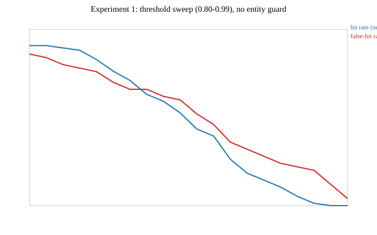

# Experiment 1: threshold sweep

PRD section 16.2(1) / docs/plan/09-milestone-m6-benchmarking.md task 2.
Generated by `ThresholdSweepExperimentTest`, against the real
all-MiniLM-L6-v2 embedding model and the full labelled corpus
(76 near-duplicate pairs, 50 adversarial pairs) - no mocking of
either. No entity guard applied here (that ablation is
experiment 2); this is the raw embedding-similarity
precision/recall curve.

Raw data: `experiment-1-threshold-sweep.csv`.

## Chosen raw operating point (pre-guard)

**threshold = 0.95**, hit rate 10.5%, false-hit rate 24.0% (no guard).

Justification: among thresholds that keep the cache meaningfully useful (hit rate >= 10%, a floor only to exclude degenerate near-zero-hit-rate points), this is the one that minimises the raw false-hit rate - the Pareto-best point actually measured on the full corpus. This is a *pre-guard* reference point only: the entity/numeric guard (experiment 2) changes the false-hit side of this trade-off substantially and is the deciding factor for the final production threshold, matching Phase 07's own finding that every swept threshold has a nonzero false-hit rate without the guard active.
