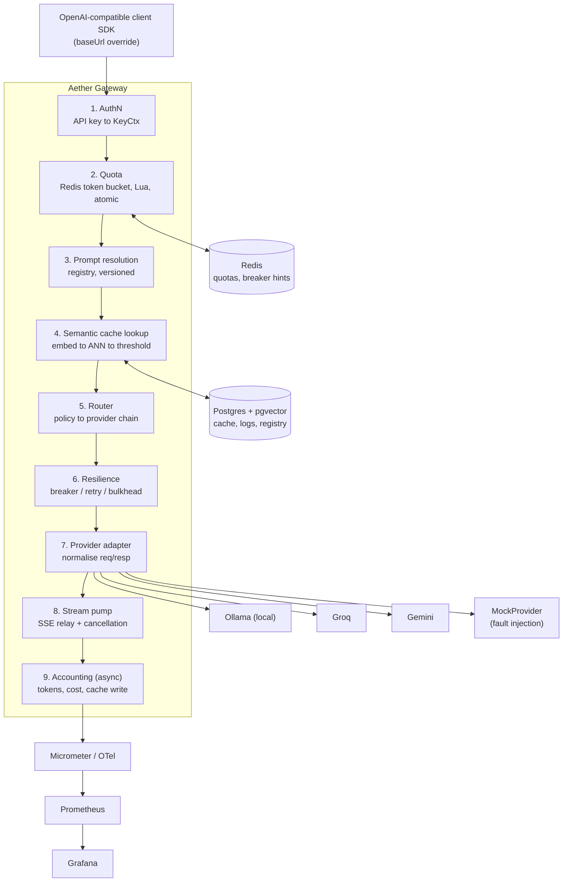
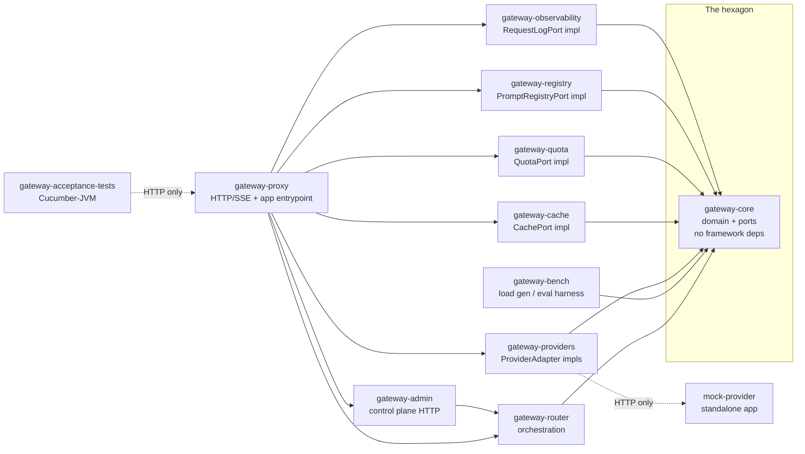

# Architecture diagram

Rendered form of PRD section 6's ASCII diagram, for use in the README
(PRD section 20, item 3).

## Module layout

Both diagrams source from PRD section 6 and `docs/design/module-boundaries.md`; if either changes, update both this file and the source document in the same change.
